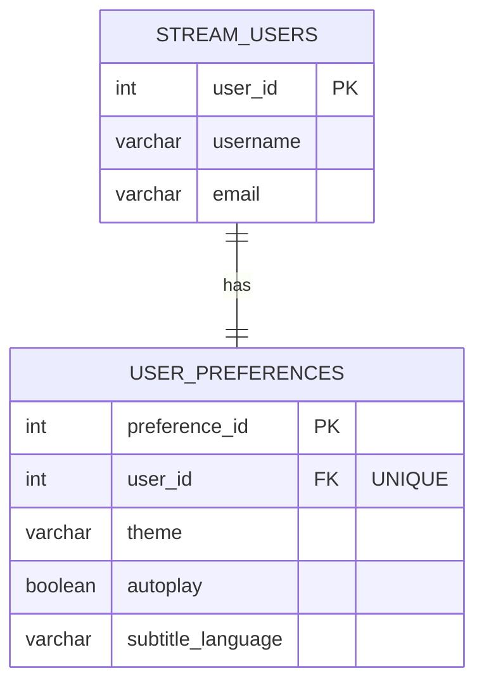
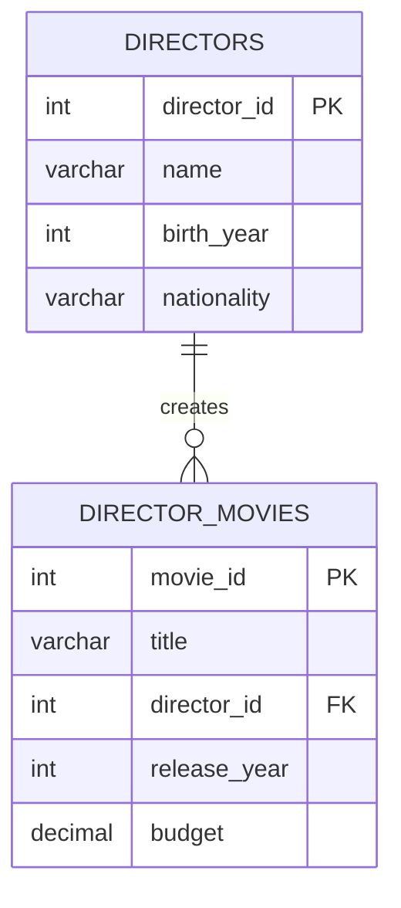
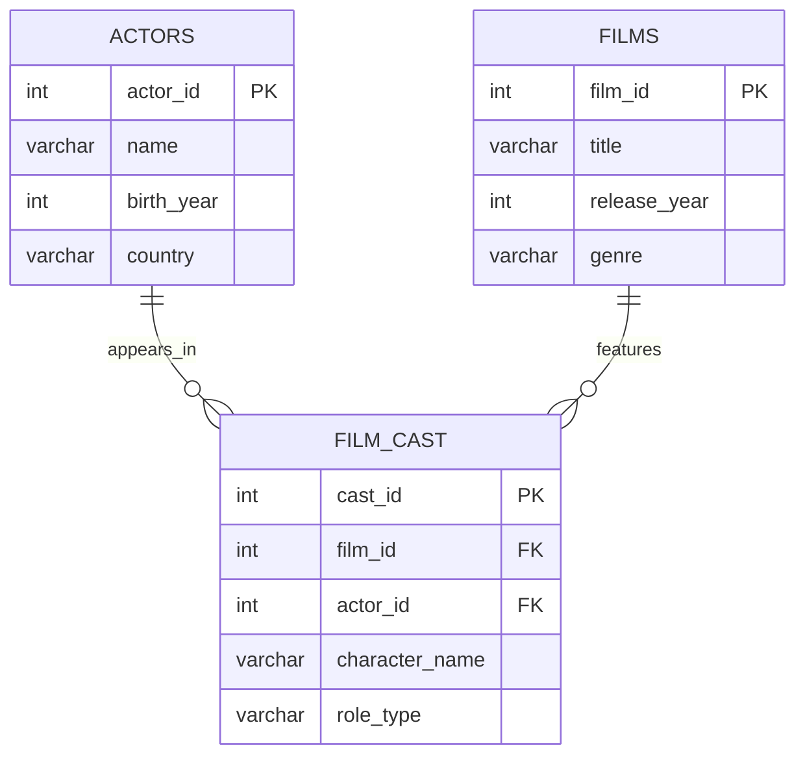

## 3. Understanding Database Relationships

Relationships define how tables connect to each other using PRIMARY KEY and FOREIGN KEY constraints.

### 3.1 ONE-TO-ONE Relationship

**Definition:** One record in Table A relates to exactly **one** record in Table B.

**Example:** Each user has one profile with detailed settings.

```sql
CREATE TABLE stream_users (
    user_id SERIAL PRIMARY KEY,
    username VARCHAR(50) NOT NULL,
    email VARCHAR(100) UNIQUE NOT NULL
);

CREATE TABLE user_preferences (
    preference_id SERIAL PRIMARY KEY,
    user_id INTEGER UNIQUE NOT NULL,  -- UNIQUE makes it one-to-one
    theme VARCHAR(20) DEFAULT 'dark',
    autoplay BOOLEAN DEFAULT true,
    subtitle_language VARCHAR(20) DEFAULT 'English',
    FOREIGN KEY (user_id) REFERENCES stream_users(user_id) ON DELETE CASCADE
);

-- Insert data
INSERT INTO stream_users (username, email) VALUES
('cinephile_jane', 'jane@email.com'),
('binge_watcher_bob', 'bob@email.com');

INSERT INTO user_preferences (user_id, theme, autoplay) VALUES
(1, 'dark', true),
(2, 'light', false);

-- View user with their preferences
SELECT * FROM stream_users;
SELECT * FROM user_preferences;
```

**Key Points:**
- The `UNIQUE` constraint on `user_id` in `user_preferences` ensures each user can have only ONE preference record
- `ON DELETE CASCADE` means if a user is deleted, their preferences are automatically deleted too

**Mermaid Diagram:**



### 3.2 ONE-TO-MANY Relationship

**Definition:** One record in Table A relates to **multiple** records in Table B.

**Example:** One director creates many movies.

```sql
CREATE TABLE directors (
    director_id SERIAL PRIMARY KEY,
    name VARCHAR(100) NOT NULL,
    birth_year INTEGER,
    nationality VARCHAR(50)
);

CREATE TABLE director_movies (
    movie_id SERIAL PRIMARY KEY,
    title VARCHAR(200) NOT NULL,
    director_id INTEGER NOT NULL,  -- No UNIQUE here, allows multiple movies per director
    release_year INTEGER,
    budget DECIMAL(12, 2),
    FOREIGN KEY (director_id) REFERENCES directors(director_id) ON DELETE RESTRICT
);

-- Insert directors
INSERT INTO directors (name, birth_year, nationality) VALUES
('Christopher Nolan', 1970, 'British-American'),
('Greta Gerwig', 1983, 'American'),
('Denis Villeneuve', 1967, 'Canadian');

-- Insert movies (multiple movies per director)
INSERT INTO director_movies (title, director_id, release_year, budget) VALUES
('Inception', 1, 2010, 160000000),
('Interstellar', 1, 2014, 165000000),
('Dunkirk', 1, 2017, 100000000),
('Lady Bird', 2, 2017, 10000000),
('Little Women', 2, 2019, 40000000),
('Arrival', 3, 2016, 47000000),
('Blade Runner 2049', 3, 2017, 150000000);

-- View all directors
SELECT * FROM directors;

-- View all movies
SELECT * FROM director_movies;

-- Count movies per director
SELECT 
    director_id,
    COUNT(*) AS movie_count
FROM director_movies
GROUP BY director_id;
```

**Key Points:**
- No `UNIQUE` constraint on `director_id` in `director_movies` - allows multiple movies per director
- `ON DELETE RESTRICT` prevents deleting a director if they have movies
- One director (parent) can have many movies (children)

**Mermaid Diagram:**



### 3.3 MANY-TO-MANY Relationship

**Definition:** Multiple records in Table A relate to multiple records in Table B.

**Example:** Movies have multiple actors, and actors appear in multiple movies.

**Important:** Many-to-many relationships require a **junction table** (also called bridge/linking table) that sits between the two main tables.

```sql
-- First main table
CREATE TABLE actors (
    actor_id SERIAL PRIMARY KEY,
    name VARCHAR(100) NOT NULL,
    birth_year INTEGER,
    country VARCHAR(50)
);

-- Second main table
CREATE TABLE films (
    film_id SERIAL PRIMARY KEY,
    title VARCHAR(200) NOT NULL,
    release_year INTEGER,
    genre VARCHAR(50)
);

-- Junction table (bridges the many-to-many relationship)
CREATE TABLE film_cast (
    cast_id SERIAL PRIMARY KEY,
    film_id INTEGER NOT NULL,
    actor_id INTEGER NOT NULL,
    character_name VARCHAR(100),
    role_type VARCHAR(20) DEFAULT 'supporting',
    FOREIGN KEY (film_id) REFERENCES films(film_id) ON DELETE CASCADE,
    FOREIGN KEY (actor_id) REFERENCES actors(actor_id) ON DELETE CASCADE,
    UNIQUE(film_id, actor_id)  -- Prevents same actor being cast twice in same film
);

-- Insert actors
INSERT INTO actors (name, birth_year, country) VALUES
('Leonardo DiCaprio', 1974, 'USA'),
('Marion Cotillard', 1975, 'France'),
('Tom Hardy', 1977, 'UK'),
('Anne Hathaway', 1982, 'USA'),
('Matthew McConaughey', 1969, 'USA');

-- Insert films
INSERT INTO films (title, release_year, genre) VALUES
('Inception', 2010, 'Sci-Fi'),
('The Dark Knight Rises', 2012, 'Action'),
('Interstellar', 2014, 'Sci-Fi'),
('Dunkirk', 2017, 'War');

-- Create the many-to-many relationships through the junction table
INSERT INTO film_cast (film_id, actor_id, character_name, role_type) VALUES
-- Inception has 3 actors
(1, 1, 'Dom Cobb', 'lead'),
(1, 2, 'Mal Cobb', 'supporting'),
(1, 3, 'Eames', 'supporting'),
-- The Dark Knight Rises has 2 actors
(2, 3, 'Bane', 'lead'),
(2, 4, 'Catwoman', 'lead'),
-- Interstellar has 2 actors
(3, 4, 'Brand', 'supporting'),
(3, 5, 'Cooper', 'lead'),
-- Dunkirk has 1 actor
(4, 3, 'Farrier', 'supporting');

-- View all actors
SELECT * FROM actors;

-- View all films
SELECT * FROM films;

-- View all casting relationships
SELECT * FROM film_cast;

-- Find how many films each actor has
SELECT 
    actor_id,
    COUNT(*) AS film_count
FROM film_cast
GROUP BY actor_id
ORDER BY film_count DESC;

-- Find how many actors each film has
SELECT 
    film_id,
    COUNT(*) AS actor_count
FROM film_cast
GROUP BY film_id
ORDER BY actor_count DESC;
```

**Key Points:**
- `film_cast` is the junction table that connects `films` and `actors`
- Junction table has foreign keys to both main tables
- Junction table can store additional information (like `character_name`, `role_type`)
- `UNIQUE(film_id, actor_id)` prevents duplicate casting
- Allows many-to-many: one actor in many films, one film with many actors

**Mermaid Diagram:**

