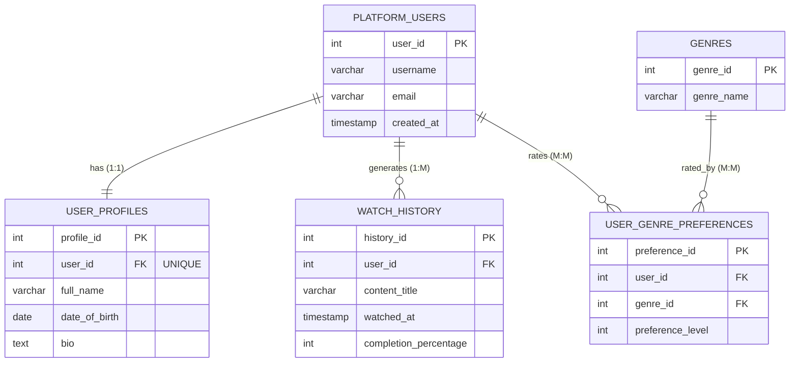

## 4. PRIMARY KEY and FOREIGN KEY

### 4.1 PRIMARY KEY

A PRIMARY KEY uniquely identifies each record in a table.

**Rules:**
- Must contain **unique** values (no duplicates)
- Cannot contain **NULL** values
- Each table can have only **ONE** primary key
- Can consist of single or multiple columns (composite key)

**Why use Primary Keys?**
- Ensures each row is unique
- Provides fast data lookup
- Used by Foreign Keys to create relationships

```sql
-- Single column primary key (most common)
CREATE TABLE streaming_platforms (
    platform_id SERIAL PRIMARY KEY,  -- Auto-incrementing primary key
    platform_name VARCHAR(50) NOT NULL,
    founded_year INTEGER
);

INSERT INTO streaming_platforms (platform_name, founded_year) VALUES
('StreamFlix', 2010),
('WatchNow', 2015),
('VideoHub', 2018);

SELECT * FROM streaming_platforms;

-- Composite primary key (multiple columns together form the key)
CREATE TABLE subscription_history (
    user_id INTEGER,
    plan_change_date DATE,
    new_plan VARCHAR(30),
    PRIMARY KEY (user_id, plan_change_date)  -- Both columns together are unique
);

INSERT INTO subscription_history VALUES
(1, '2024-01-15', 'Basic'),
(1, '2024-06-20', 'Premium'),  -- Same user, different date (allowed)
(2, '2024-01-15', 'Standard'); -- Different user, same date (allowed)
-- (1, '2024-01-15', 'Pro') would fail - duplicate composite key

SELECT * FROM subscription_history;

-- Adding primary key to existing table
CREATE TABLE content_ratings (
    rating_code VARCHAR(10),
    description TEXT
);

-- Add primary key constraint after table creation
ALTER TABLE content_ratings
ADD PRIMARY KEY (rating_code);

INSERT INTO content_ratings VALUES
('G', 'General Audiences'),
('PG', 'Parental Guidance'),
('PG-13', 'Parents Strongly Cautioned'),
('R', 'Restricted');

SELECT * FROM content_ratings;
```

### 4.2 FOREIGN KEY

A FOREIGN KEY creates a link between two tables by referencing the primary key of another table.

**Rules:**
- Must reference a **PRIMARY KEY** or **UNIQUE** column in another table
- Can contain **NULL** values (unless specified NOT NULL)
- Multiple foreign keys can exist in one table
- Enforces **referential integrity** (can't reference non-existent records)

**Why use Foreign Keys?**
- Maintains data consistency
- Prevents orphaned records
- Enforces valid relationships between tables

```sql
-- Parent table (must be created first)
CREATE TABLE subscribers (
    subscriber_id SERIAL PRIMARY KEY,
    email VARCHAR(100) UNIQUE NOT NULL,
    username VARCHAR(50) NOT NULL,
    join_date DATE DEFAULT CURRENT_DATE
);

-- Another parent table
CREATE TABLE subscription_plans (
    plan_id SERIAL PRIMARY KEY,
    plan_name VARCHAR(30) NOT NULL,
    monthly_price DECIMAL(5, 2) NOT NULL,
    max_screens INTEGER DEFAULT 1
);

-- Child table with foreign keys
CREATE TABLE active_subscriptions (
    subscription_id SERIAL PRIMARY KEY,
    subscriber_id INTEGER NOT NULL,
    plan_id INTEGER NOT NULL,
    start_date DATE DEFAULT CURRENT_DATE,
    auto_renew BOOLEAN DEFAULT true,
    
    -- Foreign key constraints
    FOREIGN KEY (subscriber_id) REFERENCES subscribers(subscriber_id),
    FOREIGN KEY (plan_id) REFERENCES subscription_plans(plan_id)
);

-- Insert parent data first
INSERT INTO subscribers (email, username) VALUES
('alice@example.com', 'alice_movies'),
('bob@example.com', 'bob_streams');

INSERT INTO subscription_plans (plan_name, monthly_price, max_screens) VALUES
('Basic', 9.99, 1),
('Standard', 14.99, 2),
('Premium', 19.99, 4);

-- Now insert child data (referencing parent IDs)
INSERT INTO active_subscriptions (subscriber_id, plan_id) VALUES
(1, 3),  -- Alice has Premium plan
(2, 2);  -- Bob has Standard plan

-- This would fail - subscriber_id 999 doesn't exist
-- INSERT INTO active_subscriptions (subscriber_id, plan_id) VALUES (999, 1);

-- View the data
SELECT * FROM subscribers;
SELECT * FROM subscription_plans;
SELECT * FROM active_subscriptions;
```

### 4.3 Foreign Key Actions (ON DELETE and ON UPDATE)

These control what happens to child records when parent records are modified or deleted.

```sql
-- ON DELETE CASCADE: Delete child records when parent is deleted
CREATE TABLE streaming_devices (
    device_id SERIAL PRIMARY KEY,
    subscriber_id INTEGER NOT NULL,
    device_name VARCHAR(50),
    device_type VARCHAR(30),
    registered_date DATE DEFAULT CURRENT_DATE,
    
    FOREIGN KEY (subscriber_id) REFERENCES subscribers(subscriber_id) 
        ON DELETE CASCADE  -- If subscriber deleted, delete their devices too
        ON UPDATE CASCADE  -- If subscriber_id changes, update device records
);

INSERT INTO streaming_devices (subscriber_id, device_name, device_type) VALUES
(1, 'Living Room TV', 'Smart TV'),
(1, 'iPhone 12', 'Mobile'),
(2, 'Laptop', 'Computer');

-- If we delete subscriber 1, their 2 devices are automatically deleted
-- DELETE FROM subscribers WHERE subscriber_id = 1;

-- ON DELETE SET NULL: Keep child records but remove parent reference
CREATE TABLE watchlist (
    watchlist_id SERIAL PRIMARY KEY,
    subscriber_id INTEGER,
    movie_title VARCHAR(200),
    added_date TIMESTAMP DEFAULT CURRENT_TIMESTAMP,
    priority INTEGER DEFAULT 5,
    
    FOREIGN KEY (subscriber_id) REFERENCES subscribers(subscriber_id) 
        ON DELETE SET NULL  -- If subscriber deleted, keep watchlist but set subscriber_id to NULL
);

INSERT INTO watchlist (subscriber_id, movie_title, priority) VALUES
(1, 'Inception', 10),
(2, 'Interstellar', 8);

-- If we delete subscriber 1, their watchlist entry remains but subscriber_id becomes NULL

-- ON DELETE RESTRICT: Prevent deletion if child records exist
CREATE TABLE payment_methods (
    payment_id SERIAL PRIMARY KEY,
    subscriber_id INTEGER NOT NULL,
    card_type VARCHAR(20),
    card_last_four CHAR(4),
    expiry_date DATE,
    
    FOREIGN KEY (subscriber_id) REFERENCES subscribers(subscriber_id) 
        ON DELETE RESTRICT  -- Cannot delete subscriber if they have payment methods
);

INSERT INTO payment_methods (subscriber_id, card_type, card_last_four, expiry_date) VALUES
(1, 'Visa', '1234', '2026-12-31'),
(2, 'Mastercard', '5678', '2027-06-30');

-- This would fail - cannot delete subscriber because payment method exists
-- DELETE FROM subscribers WHERE subscriber_id = 1;
-- Must delete payment method first, then subscriber

-- ON DELETE NO ACTION (default): Similar to RESTRICT
-- ON DELETE SET DEFAULT: Set to default value when parent is deleted

SELECT * FROM streaming_devices;
SELECT * FROM watchlist;
SELECT * FROM payment_methods;
```

**Foreign Key Actions Summary:**

| Action | Effect |
|--------|--------|
| `CASCADE` | Delete/update child records automatically |
| `SET NULL` | Set foreign key to NULL in child records |
| `SET DEFAULT` | Set foreign key to default value in child records |
| `RESTRICT` | Prevent parent deletion if children exist (checked immediately) |
| `NO ACTION` | Prevent parent deletion if children exist (checked at end of statement) |

### 4.4 Complete Relationship Example

Here's a complete streaming platform database demonstrating all three relationship types:

```sql
-- Users (main table)
CREATE TABLE platform_users (
    user_id SERIAL PRIMARY KEY,
    username VARCHAR(50) UNIQUE NOT NULL,
    email VARCHAR(100) UNIQUE NOT NULL,
    created_at TIMESTAMP DEFAULT CURRENT_TIMESTAMP
);

-- One-to-One: User Profile (each user has ONE profile)
CREATE TABLE user_profiles (
    profile_id SERIAL PRIMARY KEY,
    user_id INTEGER UNIQUE NOT NULL,  -- UNIQUE makes it one-to-one
    full_name VARCHAR(100),
    date_of_birth DATE,
    bio TEXT,
    FOREIGN KEY (user_id) REFERENCES platform_users(user_id) ON DELETE CASCADE
);

-- One-to-Many: User Watch History (each user has MANY watch records)
CREATE TABLE watch_history (
    history_id SERIAL PRIMARY KEY,
    user_id INTEGER NOT NULL,  -- No UNIQUE, allows multiple records per user
    content_title VARCHAR(200),
    watched_at TIMESTAMP DEFAULT CURRENT_TIMESTAMP,
    completion_percentage INTEGER,
    FOREIGN KEY (user_id) REFERENCES platform_users(user_id) ON DELETE CASCADE
);

-- Many-to-Many Setup: Users and Genres (users like MANY genres, genres liked by MANY users)
CREATE TABLE genres (
    genre_id SERIAL PRIMARY KEY,
    genre_name VARCHAR(50) UNIQUE NOT NULL
);

-- Junction table for many-to-many
CREATE TABLE user_genre_preferences (
    preference_id SERIAL PRIMARY KEY,
    user_id INTEGER NOT NULL,
    genre_id INTEGER NOT NULL,
    preference_level INTEGER CHECK (preference_level BETWEEN 1 AND 10),
    FOREIGN KEY (user_id) REFERENCES platform_users(user_id) ON DELETE CASCADE,
    FOREIGN KEY (genre_id) REFERENCES genres(genre_id) ON DELETE CASCADE,
    UNIQUE(user_id, genre_id)  -- Each user can rate each genre only once
);

-- Insert sample data
INSERT INTO platform_users (username, email) VALUES
('movie_buff', 'buff@example.com'),
('series_fan', 'fan@example.com');

INSERT INTO user_profiles (user_id, full_name, date_of_birth) VALUES
(1, 'Alex Johnson', '1990-05-15'),
(2, 'Sam Williams', '1985-08-22');

INSERT INTO watch_history (user_id, content_title, completion_percentage) VALUES
(1, 'Stellar Voyage', 100),
(1, 'Epic Quest', 67),
(1, 'Dark Alley', 45),
(2, 'True Crime Story', 100),
(2, 'Laugh Factory', 80);

INSERT INTO genres (genre_name) VALUES
('Sci-Fi'), ('Fantasy'), ('Thriller'), ('Documentary'), ('Comedy');

INSERT INTO user_genre_preferences (user_id, genre_id, preference_level) VALUES
(1, 1, 9),  -- movie_buff loves Sci-Fi (9/10)
(1, 2, 8),  -- movie_buff likes Fantasy (8/10)
(1, 3, 6),  -- movie_buff neutral on Thriller (6/10)
(2, 3, 9),  -- series_fan loves Thriller (9/10)
(2, 4, 7),  -- series_fan likes Documentary (7/10)
(2, 5, 8);  -- series_fan likes Comedy (8/10)

-- View all data
SELECT * FROM platform_users;
SELECT * FROM user_profiles;
SELECT * FROM watch_history;
SELECT * FROM genres;
SELECT * FROM user_genre_preferences;

-- Count watch history per user
SELECT 
    user_id,
    COUNT(*) AS total_watched,
    AVG(completion_percentage) AS avg_completion
FROM watch_history
GROUP BY user_id;

-- Count genre preferences per user
SELECT 
    user_id,
    COUNT(*) AS genres_rated,
    AVG(preference_level) AS avg_preference
FROM user_genre_preferences
GROUP BY user_id;
```

**Complete System Diagram:**


